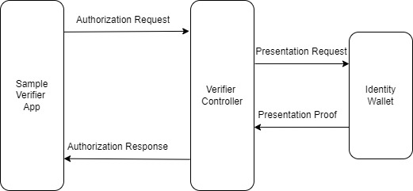

# Sample Verifier Web application for DICE

The sample verifier web application demonstrates the functionality of DICE Verification Controller. 

## Pre-requisites
Different components required for this demo are: 
- DICE Verification component 
- DICE Identity Wallet for Holder
- Credentials from sample-issuer-webapp  
- Verifiable Sample Web Application  (sample-verifier-webapp) 

DICE verification component is hosted at: https://futurebankvcauthcontroller.wiprobc.com

DICE Identity Wallet need to be installed on the mobile phone. The wallet is available on both Android and iOS platforms. 
 - On iOS, it be can downloaded from: [DICE ID - Apple playstore](https://apps.apple.com/in/app/dice-id/id1624858853)
 - On Android, the link is: [DICE ID - Apps on Google Play](https://play.google.com/store/apps/details?id=com.diwallet1)

To get credentials from sample issuer webapp, please refer to https://github.com/diceid/sample-issuer-webapp/blob/main/README.md

Sample verifier web application can be downloaded from here. 

## How to run
Once code is downloaded, follow the steps below to install and build the code:
1. change inside the directory sample-verififier webapp
2. build and Install webapp 
    - npm install 
    - npm run build 
    - npm start 
 
By default this will start the server on localhost:3000. Make sure that this url is mapped to public ip so that DICE Veirifier platform can access this and is able to return the result of verification back to the sample verifier webapp.

Sample-verifier-webapp/src/vc_services/VC_AuthService.js 
      - Constants.clientRoot -> should point to the URL where sample verifier application is hosted. This URL should be accessible from Verifier controller 

One has to go through the following steps for verifying the credentials obtained with DICE issuer platform:
 - After the server has started with npm start, connect to http://localhost:3000 from your browser
 - click on "Veirfy Credentials" 
 - QR code is displayed on the screen, scan this with your DICE Identity Wallet on mobile phone
 - Present the requested presentation attributes
 - Once credential is presented, DICE verifier Platform verifies the credential and result of verification is sent back the the sample verifier webapp as callback
  
## Flow Diagram  
The flow of Verifiable credential between these different parties is: 

## Customization 
One can use the default Schema hardcoded in sample issuer webapp and the corresponding default presentation request. But if different presentation request is required, then the follwoing steps needs to be followed:

1.	Configure Presentation request parameters with DICE Verification Controller:
https://futurebankvcauthcontroller.wiprobc.com/  POST api/vc-config. This API can be used to configure the presentation request parameters. Holder will present proof in terms of these parameters. The id of this configuration need to be passed in the sample application file: Sample-verifier-webapp/src/vc_services/VC_AuthService.js
2. Example of JSON required to create presentation request:
   -  {
    "id": "demo-access",
    "subject_identifier": "demo-access",
    "configuration": {
      "name": "demo-access",
      "version": "1.0",
      "requested_attributes": [
        {
          "name": null,
          "names": [
            "Name",
            "Age",
            "PAN",
            "PostalAddress"
          ],
          "label": null,
          "restrictions": [
              "issuer_did": "CEvn5gT3CpmU9kEHCzwdZE"
          ]
        }
      ],
      "requested_predicates": []
    }
  },

3.	Sample-verifier-webapp/src/vc_services/VC_AuthService.js 
      - userManager.settings.metadata.authorization_endpoint -> change pres_req_conf_id to the presentation request id you have created. If you haven’t created any new id, then the default id verified-email can be used.
5.	Install and build the application as mentioned before

Note: Make sure that you have credentials corresponding to this presentation request in your DICE Wallet. If you create new presentation request, create the schema with same attributes as presentation request and issue credentials to you with DICE issuer platofrm from sample issuer application.

